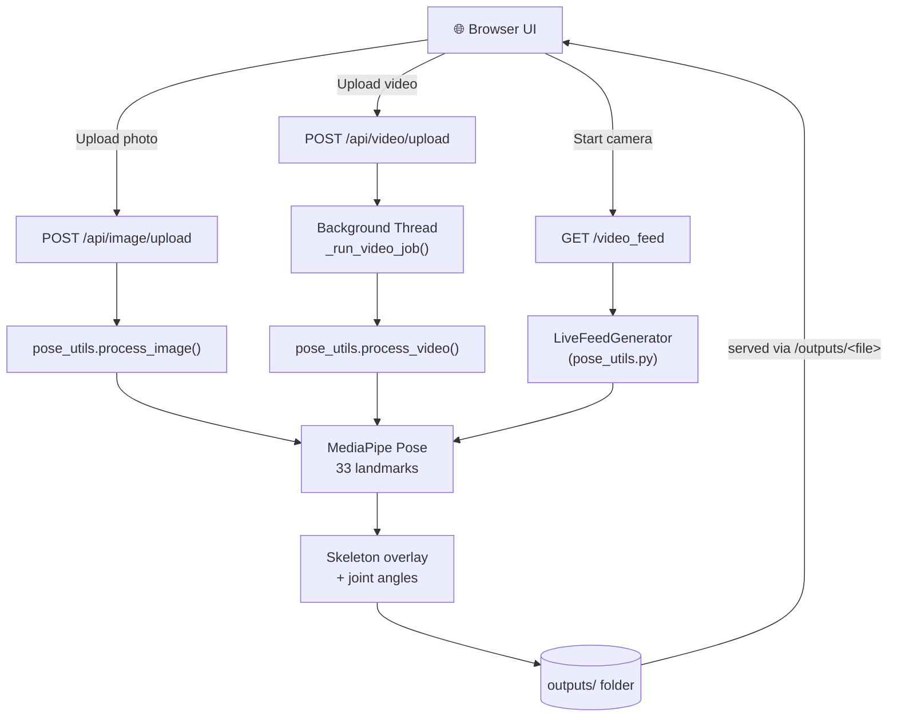
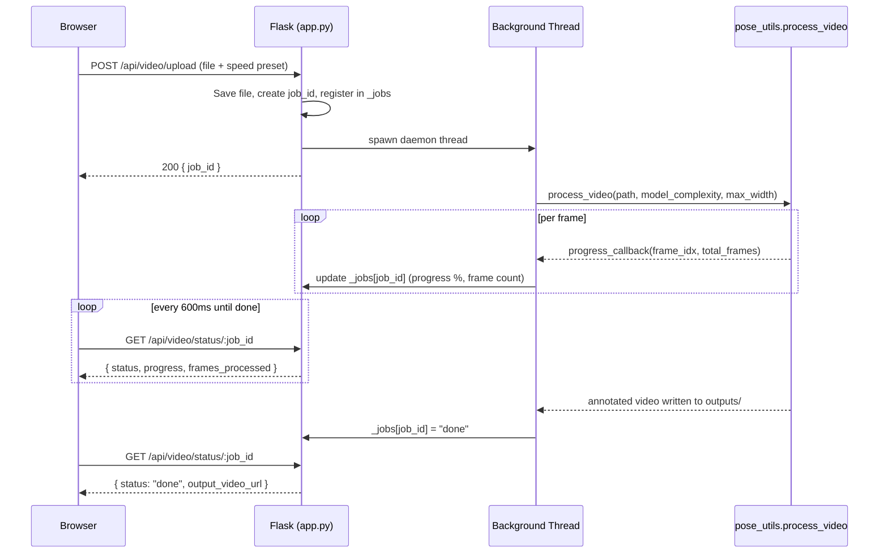
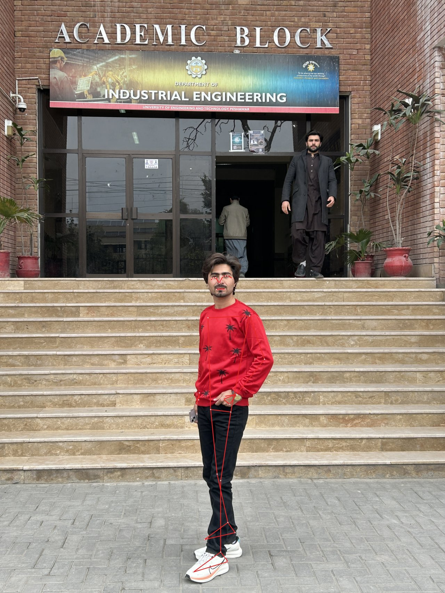

<div align="center">

# 🤸 Kinetra — Real-Time Human Pose Estimation

### See the skeleton inside every frame.

A Flask + MediaPipe web app that detects **33 body landmarks** in photos, videos, and a live webcam feed — then draws the skeleton, computes joint angles, and hands you the raw landmark data back.

[](https://www.python.org/)
[](https://flask.palletsprojects.com/)
[](https://ai.google.dev/edge/mediapipe)
[](https://opencv.org/)
[](https://www.docker.com/)

</div>

---

## 📚 Table of Contents

- [📌 Project Overview](#-project-overview)
- [🎯 Problem Statement](#-problem-statement)
- [✨ Main Features](#-main-features)
- [🧠 How Pose Estimation Works](#-how-pose-estimation-works)
- [🏗️ System Architecture](#️-system-architecture)
- [🛠️ Technologies & Libraries](#️-technologies--libraries)
- [📂 Project Structure](#-project-structure)
- [⚙️ Requirements](#️-requirements)
- [🔧 Setup Instructions](#-setup-instructions)
- [▶️ Running Locally](#️-running-locally)
- [📸 Screenshots](#-screenshots)
- [📊 Example Output](#-example-output)
- [🔮 Future Improvements](#-future-improvements)
- [👨‍💻 Author](#-author)
- [📞 Contact](#-contact)

---

## 📌 Project Overview

**Kinetra** is a self-contained Flask application built around [MediaPipe Pose](https://ai.google.dev/edge/mediapipe/solutions/vision/pose_landmarker), Google's pretrained body-landmark model. It wraps that model in three practical, browser-based workflows so pose estimation isn't just a notebook experiment — it's something you can actually click through:

| Mode | What it does |
|---|---|
| 🖼️ **Image** | Upload a photo → get it back instantly with the skeleton drawn on top, joint-angle gauges, and a downloadable CSV of every landmark |
| 🎥 **Video** | Upload a clip → every frame is tracked in a background thread with a **live progress bar**, then you get an annotated copy back |
| 📡 **Live** | Opens the webcam on the machine running the server and streams the tracked skeleton in real time |

No GPU required — everything runs on CPU via MediaPipe's optimized inference graph.

## 🎯 Problem Statement

Pose-estimation demos usually live inside a Jupyter notebook: run a cell, stare at one static `matplotlib` output, re-run for the next frame. That's fine for a tutorial, but it doesn't show *how* the model behaves across different input types, or what it takes to turn "a notebook that works" into "an app someone else can actually use."

Kinetra takes the same underlying MediaPipe Pose logic and asks a different question: what does this look like as a real product surface? That means:
- A UI that gives instant feedback for images, but doesn't freeze the browser on a 2-minute video — hence the background job + polling design.
- Graceful failure — no detected person, an unreadable file, or a webcam that isn't there all produce a clear message instead of a crash.
- Output you can actually use afterward: an annotated file and a landmark CSV, not just a rendered frame on screen.

## ✨ Main Features

- 🖼️ **Single-image pose detection** with skeleton overlay, radial joint-angle gauges (elbows, knees, hips), and a downloadable landmark CSV
- 🎞️ **Video tracking** with a real **live progress bar** (% complete, frame counter, elapsed time) — processed in a background thread so the UI never blocks
- ⚡ **Three speed presets** for video (`Fast` / `Balanced` / `Accurate`) that trade MediaPipe model complexity and frame width for turnaround time
- 📡 **Live webcam streaming** with an on-screen session timer and viewfinder overlay, tracked frame-by-frame with a persistent MediaPipe instance for temporal stability
- 📐 **Joint-angle calculations** (right/left elbow, knee, and hip) computed from landmark geometry
- 🧾 **CSV export** of all 33 landmarks (`x`, `y`, `z`, `visibility`) per detected person
- 🛡️ **Graceful degradation** — no person detected, unreadable file, or missing camera all show a clear in-UI message instead of an error page
- 🎨 **Custom-drawn skeleton rendering** (anti-aliased OpenCV lines, not MediaPipe's default thick markers) that scales proportionally to frame size

## 🧠 How Pose Estimation Works

Every mode funnels through the same core idea, implemented in [`pose_utils.py`](pose_utils.py):

1. **Frame in** — a BGR frame (from an uploaded image, a decoded video frame, or a webcam capture) is converted to RGB.
2. **MediaPipe Pose inference** — `mp.solutions.pose.Pose(...)` returns up to 33 normalized `(x, y, z, visibility)` landmarks per detected person.
3. **Low-confidence filtering** — landmarks with `visibility < 0.5` are skipped rather than drawn as noisy guesses.
4. **Skeleton rendering** — `draw_skeleton()` connects landmarks using MediaPipe's `POSE_CONNECTIONS` graph, drawn with anti-aliased OpenCV lines sized relative to the frame's width.
5. **Derived metrics** — `calculate_angle()` computes joint angles from three-point vectors (e.g. shoulder–elbow–wrist for elbow flexion).
6. **Output** — an annotated image/video frame, plus (for images) a tidy landmark DataFrame written to CSV.

Video and live modes reuse a single `mp_pose.Pose` instance across frames (rather than recreating it per-frame) so MediaPipe can use its built-in temporal tracking instead of treating every frame as a cold start.

## 🏗️ System Architecture



The video path is the most involved one, since it has to keep the browser responsive across a long-running job instead of blocking on a single request:



> **Design note:** job status and the live-feed handle both live in plain in-process Python state (`_jobs` dict, `_live_feed` global in `app.py`) — deliberately simple for a single-process app, at the cost of not being safe to run behind multiple worker processes without moving that state to something shared (see [Future Improvements](#-future-improvements)).

## 🛠️ Technologies & Libraries

| Category | Stack |
|---|---|
| **Language** | Python 3.10 |
| **Web framework** | Flask |
| **Pose estimation** | MediaPipe Pose `0.10.14` (pinned — newer releases removed the legacy `mp.solutions.pose` API this app relies on) |
| **Computer vision** | OpenCV (`opencv-python-headless`) |
| **Numerical / data** | NumPy, Pandas |
| **Concurrency** | Python `threading` (background video jobs) |
| **Frontend** | Vanilla HTML5, CSS3, JavaScript — no framework, no build step |
| **WSGI server** | Gunicorn |
| **Containerization** | Docker |

## 📂 Project Structure

```
pose_app/
├── app.py                  # Flask routes, job registry, request handling
├── pose_utils.py            # MediaPipe wrapper: image/video/live processing
├── requirements.txt
├── Dockerfile                # Container image (system libs + gunicorn)
├── .dockerignore
├── render.yaml                # Optional infra-as-code service definition
├── templates/
│   ├── base.html
│   ├── index.html            # Home page, mode picker
│   ├── image.html
│   ├── video.html
│   └── live.html
├── static/
│   ├── css/style.css
│   └── js/main.js
├── docs/
│   └── screenshots/           # README assets
├── uploads/                  # User-submitted files (gitignored, deleted post-processing)
└── outputs/                   # Annotated results served back to the user (gitignored)
```

## ⚙️ Requirements

- **Python 3.10** (MediaPipe `0.10.14` does not support Python 3.12+)
- `pip`
- A webcam, only if you want to use **Live** mode
- ~2–3 GB free disk for the first-time MediaPipe/OpenCV model + dependency downloads

## 🔧 Setup Instructions

```bash
git clone https://github.com/Engrziaullah/pose-estimation.git
cd pose-estimation

python -m venv venv
source venv/bin/activate        # Windows: venv\Scripts\activate

pip install -r requirements.txt
```

> ⚠️ **mediapipe is pinned to `0.10.14`.** Releases after ~0.10.14/0.10.21 removed the legacy `mp.solutions.pose` API this app relies on — installing an unpinned/newer version will break at import time.

## ▶️ Running Locally

```bash
python app.py
```

Then open **http://127.0.0.1:5000** in your browser and pick a mode from the home page.

> **Live mode note:** the webcam is opened by OpenCV *on the machine running `app.py`* — not the visitor's browser camera. That's the standard behavior for a local Flask app run on your own machine.

## 📸 Screenshots

**Image mode** — real output from this project (skeleton overlay + joint-angle gauges):



> 📷 Screenshots of the Video and Live mode UI aren't included yet — planned for a future update.

## 📊 Example Output

Alongside the annotated image/video, image mode also returns a CSV of every detected landmark. This is a real excerpt from an actual run (first 10 of 33 landmarks):

| id | landmark | x | y | z | visibility |
|---|---|---|---|---|---|
| 0 | NOSE | 0.4924 | 0.4776 | -0.2951 | 1.0 |
| 1 | LEFT_EYE_INNER | 0.5009 | 0.4660 | -0.2789 | 1.0 |
| 2 | LEFT_EYE | 0.5068 | 0.4655 | -0.2788 | 1.0 |
| 3 | LEFT_EYE_OUTER | 0.5120 | 0.4653 | -0.2789 | 1.0 |
| 4 | RIGHT_EYE_INNER | 0.4846 | 0.4680 | -0.2623 | 1.0 |
| 7 | LEFT_EAR | 0.5220 | 0.4693 | -0.1503 | 1.0 |
| 8 | RIGHT_EAR | 0.4752 | 0.4736 | -0.0798 | 1.0 |
| 9 | MOUTH_LEFT | 0.5061 | 0.4872 | -0.2464 | 1.0 |

`x`/`y` are normalized to `[0, 1]` relative to image width/height, `z` is relative depth (roughly hip-depth as the origin), and `visibility` is MediaPipe's confidence that the landmark is actually visible.

## 🔮 Future Improvements

- 🗄️ Move job/live-feed state out of process memory (e.g. Redis) so the app can run behind multiple worker processes/instances
- 📷 Rebuild Live mode around the browser's `getUserMedia` API so it works when the server isn't the same machine as the camera
- ☁️ Persist `outputs/` to object storage (e.g. S3-compatible) instead of local disk
- 🧪 Add automated tests around `pose_utils.py`'s pure functions (angle math, landmark parsing)
- 🔐 Add basic upload rate-limiting/validation hardening for public-facing use
- 🖥️ GPU-accelerated inference path for faster video processing on supported hardware

## 👨‍💻 Author

**Zia Ullah**
GitHub: [@Engrziaullah](https://github.com/Engrziaullah)

## 📞 Contact

- 📧 Email: [ziaullahbj9@gmail.com](mailto:ziaullahbj9@gmail.com)
- 💻 GitHub: [github.com/Engrziaullah](https://github.com/Engrziaullah)

---

<div align="center">

If this project was useful or interesting, consider ⭐ starring the repo.

</div>
